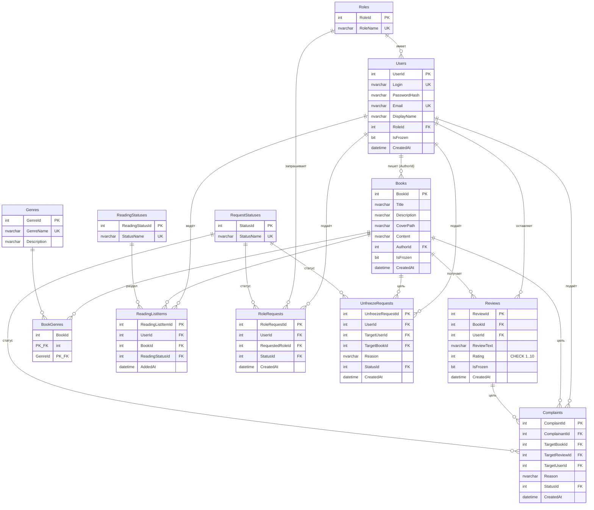

# Отчёт по учебной практике. Часть 1. База данных

> Заполните разделы, вставьте скриншоты и экспортируйте документ в **PDF**.

---

## 1. Титульный лист

- Тема: Проектирование и реализация базы данных информационной системы
  «Читай, Пиши и не спиши».
- ФИО студента, группа, преподаватель, год.

## 2. Описание предметной области

Компания «ШутИКроль» разрабатывает прототип сервиса для свободного распространения
книг начинающих авторов («Читай, Пиши и не спиши»). База данных хранит сведения о
пользователях и их ролях (Читатель, Автор, Администратор), книгах и их жанрах,
отзывах с оценками, списках чтения, а также о жалобах и заявках (на роль автора и на
разморозку аккаунта/книги).

Пользователь регистрируется и получает роль Читателя; может подать заявку на роль
Автора. Автор публикует книги (название, описание, обложка, текст), каждая книга
относится к одному или нескольким жанрам. Читатели добавляют книги в списки чтения
(Заброшено / В планах / Читаю / Прочитано), оставляют отзывы с оценкой от 1 до 10,
жалуются на книги, отзывы или авторов. Администратор обрабатывает жалобы и заявки,
может «заморозить» книгу, отзыв или аккаунт; пострадавший может оспорить заморозку.

База данных приведена к третьей нормальной форме (3НФ): каждый неключевой атрибут
зависит только от первичного ключа, транзитивные зависимости вынесены в справочники
(`Roles`, `Genres`, `ReadingStatuses`, `RequestStatuses`), связь «многие-ко-многим»
книга↔жанр реализована таблицей `BookGenres`.

## 3. ER-диаграмма

Вставьте скриншот диаграммы из SSMS (`ReadWriteDB → Database Diagrams → New Database Diagram`).
Ниже — логическая модель (Mermaid), её можно использовать как ориентир:

## 4. Скрипт создания базы данных

Полный текст — в файле `01_CreateDatabase.sql` (приложить файлом). Скрипт рабочий,
проверен на SQL Server.

## 5. Содержание CSV-файлов

Приведите по 3–5 строк из нескольких файлов в виде таблиц. Пример для `Users`:

| UserId | Login | Email | DisplayName | RoleId | IsFrozen |
|--------|-------|-------|-------------|--------|----------|
| 1 | admin | admin@shootandbunny.ru | Администратор | 3 | 0 |
| 2 | ivan_author | ivan@mail.ru | Иван Писатель | 2 | 0 |
| 5 | reader_kate | kate@mail.ru | Катя Читающая | 1 | 0 |

Пример для `Reviews`:

| ReviewId | BookId | UserId | Rating | CreatedAt |
|----------|--------|--------|--------|-----------|
| 1 | 1 | 5 | 10 | 2025-03-01 12:00:00 |
| 2 | 1 | 6 | 7 | 2025-03-02 13:00:00 |
| 9 | 4 | 8 | 4 | 2025-03-09 20:00:00 |

## 6. Скриншоты импорта

Минимум для двух таблиц: окно мастера, сопоставление столбцов, результат.

## 7. Тексты запросов и скриншоты результатов

Для каждого из 9 запросов: текст (из `02_Queries.sql`) + скриншот результата.

1. Простая выборка — авторы (логин, имя).
2. INNER JOIN — отзывы (книга, логин, рейтинг, дата).
3. LEFT JOIN — пользователи и число книг в списках чтения.
4. RIGHT JOIN — книги и число отзывов.
5. Агрегация — по жанрам: число книг и средний рейтинг.
6. Подзапрос (EXISTS) — пользователи с отзывом на 10.
7. Вычисляемое поле — топ-5 книг по числу отзывов.
8. Оконная функция — ранг книги внутри автора по среднему рейтингу.
9. Оконная функция — предыдущий/следующий рейтинг отзыва (LAG/LEAD).

## 8. Резервное копирование и восстановление

Скриншоты бэкапа, восстановления и проверки данных. Скриншоты генерации полного
скрипта (схема + данные) и восстановления БД из него.

## 9. Экспорт данных

Скриншоты экспорта в CSV и в Excel, а также содержимого полученных файлов.
Файлы приложить к работе.

## 10. Заключение

Что получилось, какие трудности возникли, какие навыки закрепили
(проектирование в 3НФ, T-SQL, JOIN-ы и оконные функции, импорт/экспорт,
резервное копирование в SQL Server).
